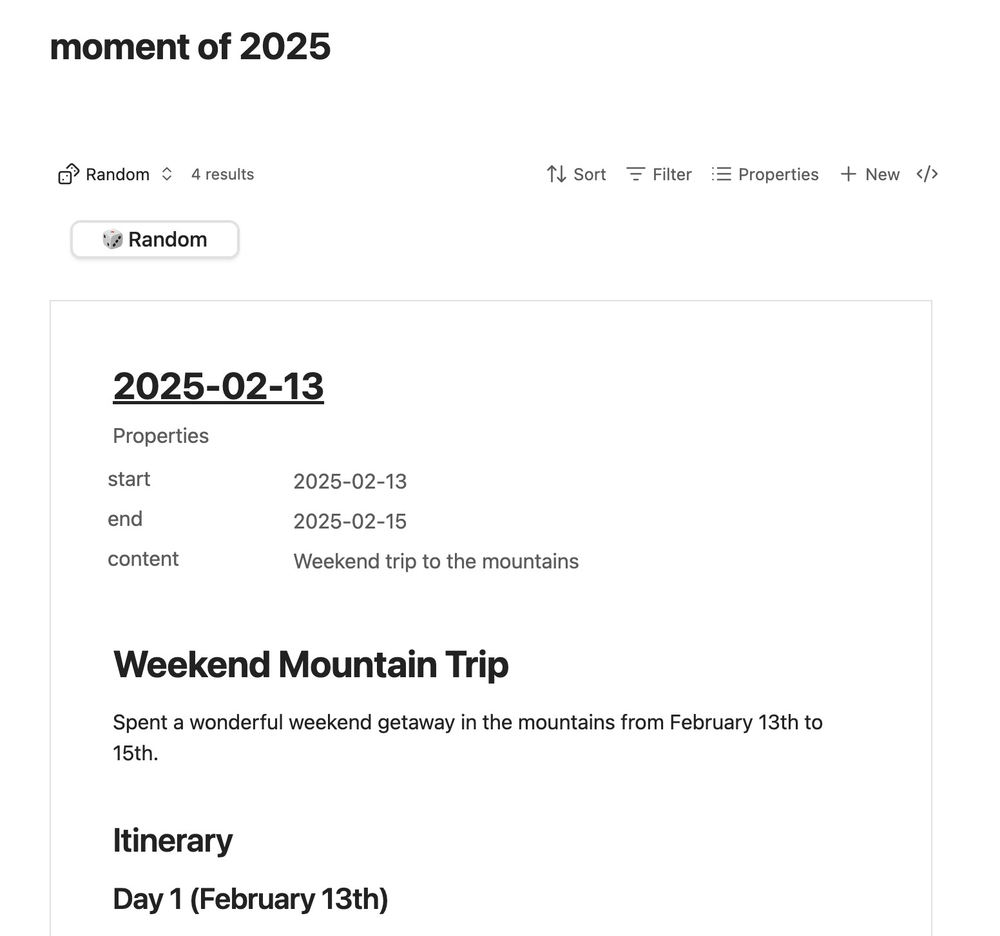

# Bases Random View

A random view for Bases. This plugin allows you to view and select a random file in your bases.

## Installation (Manual)

- Download the latest release from the [releases page](https://github.com/xjiaxiang/bases-random-view/releases)
- Create a new folder named `bases-random-view` in your vault plugins folder
- Copy the `main.js`, `manifest.json`, and `styles.css` files into the new folder
- Restart Bases
- Enable the plugin in Vault Settings
